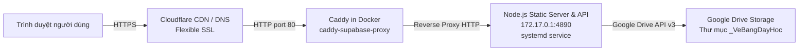

# Hướng dẫn Deploy & Vận hành: day.samnguyenphoto.com

Tài liệu triển khai và vận hành hệ thống Bảng đen & Studio giảng dạy cho domain `day.samnguyenphoto.com`.

---

## 1. Kiến trúc hệ thống



- **Cloudflare**: Xử lý chứng chỉ SSL/TLS phía ngoài (Flexible mode), forward request dạng HTTP về IP VPS.
- **Caddy (Docker)**: Chạy trong container `caddy-supabase-proxy`, lắng nghe port 80 trên host, định tuyến và reverse proxy sang backend gateway `172.17.0.1:4890`.
- **Node.js Server**: Chạy qua systemd unit `sam-teaching-visual-day.service`, phục vụ file tĩnh từ `/srv/day.samnguyenphoto.com/dist` và xử lý endpoint API `/api/luu-drive`.

---

## 2. Định tuyến (Routes)

| Đường dẫn (URL) | Đích phục vụ | Mô tả |
|---|---|---|
| `https://day.samnguyenphoto.com/dang-nhap` | `dang-nhap.html` | Cổng đăng nhập giao diện đen tối giản |
| `https://day.samnguyenphoto.com/` | `/board.html` | Màn hình Bảng đen (yêu cầu đăng nhập, tự chuyển hướng nếu chưa xác thực) |
| `https://day.samnguyenphoto.com/bang-den` | `/board.html` | Đường dẫn tường minh đến màn hình Bảng đen |
| `https://day.samnguyenphoto.com/studio` | `/index.html` | Studio giảng dạy đầy đủ tính năng |
| `https://day.samnguyenphoto.com/api/dang-nhap` | `POST /api/dang-nhap` | API xác thực đăng nhập (nhận `{taiKhoan, matKhau}`) |
| `https://day.samnguyenphoto.com/api/dang-xuat` | `POST /api/dang-xuat` | API đăng xuất (xoá session cookie) |
| `https://day.samnguyenphoto.com/api/luu-drive` | `POST /api/luu-drive` | API lưu toàn bộ trang vẽ bảng đen lên Google Drive riêng tư |
| `https://day.samnguyenphoto.com/api/so-tay` | `GET, PUT /api/so-tay` | API đồng bộ sổ tay và trang vẽ giữa các thiết bị |
---

## 3. Cách Deploy

Chạy script deploy tự động (hỗ trợ WSL và Git Bash trên Windows):

```bash
bash deploy/day.samnguyenphoto.com/deploy.sh
```

Hoặc nếu muốn chỉ định alias SSH khác (mặc định là `infiniti-vps`):

```bash
REMOTE=vps bash deploy/day.samnguyenphoto.com/deploy.sh
```

Quy trình tự động gồm 10 bước:
1. Chạy `npm run build` tại máy local để xuất bản thư mục `dist/`.
2. Đóng gói `dist/` và các script runtime (`scripts/serve.mjs`, `scripts/drive-upload.mjs`, `scripts/api-luu-drive.mjs`) bằng `tar` và chuyển lên `/srv/day.samnguyenphoto.com/`.
3. Cài đặt và kích hoạt systemd unit `sam-teaching-visual-day.service`.
4. Smoke nội bộ port 4890 trên VPS: Mốc 1 (kiểm tra `http://127.0.0.1:4890/board.html`).
5. Smoke nội bộ port 4890 trên VPS: Mốc 5 (kiểm tra `POST /api/luu-drive` trả về HTTP 400 khi mảng rỗng).
6. Cài đặt file Caddy cấu hình vào `/root/caddy/conf.d/`, sao lưu `Caddyfile.app` và thêm dòng `import`.
7. Kiểm tra cấu hình Caddy bằng `caddy validate` (tự động rollback nếu sai cú pháp).
8. Khởi động lại container `caddy-supabase-proxy`.
9. Smoke nội bộ qua Caddy port 80 với Host header `day.samnguyenphoto.com`: Mốc 2 (`/`) và Mốc 3 (`/bang-den`, `/studio`).
10. Smoke ngoài internet qua Cloudflare HTTPS: Mốc 4.

---

## 4. Giám sát & Xem Log

- **Log tiến trình Node.js (systemd journal)**:
  ```bash
  ssh infiniti-vps "journalctl -u sam-teaching-visual-day -n 50 --no-pager"
  ```
- **Log file stdout/stderr của Node.js**:
  ```bash
  ssh infiniti-vps "tail -n 50 /var/log/sam-teaching-visual-day.log"
  ```
- **Log truy cập Caddy**:
  ```bash
  ssh infiniti-vps "tail -n 50 /var/log/caddy/day.samnguyenphoto.com-access.log"
  ```

---

## 5. Quy trình Rollback

Nếu cần gỡ bỏ hoặc hoàn tác domain `day.samnguyenphoto.com`:

1. Dừng và vô hiệu hóa service Node.js:
   ```bash
   ssh infiniti-vps "systemctl stop sam-teaching-visual-day && systemctl disable sam-teaching-visual-day"
   ```
2. Khôi phục file cấu hình Caddy từ bản sao lưu gần nhất:
   ```bash
   ssh infiniti-vps "cp /root/caddy/Caddyfile.app.bak_day_<timestamp> /root/caddy/Caddyfile.app"
   ```
3. Khởi động lại Caddy container:
   ```bash
   ssh infiniti-vps "docker restart caddy-supabase-proxy"
   ```

---

## 6. Bảng xử lý lỗi thường gặp

| Hiện tượng | Nguyên nhân gốc | Cách khắc phục |
|---|---|---|
| **308 Redirect Loop** | 1. Cấu hình Caddy thiếu tiền tố `http://` làm Caddy tự bật auto-HTTPS port 443.<br/>2. Chưa import file `.caddy` vào `Caddyfile.app`.<br/>3. Chưa khởi động lại container Caddy. | 1. Đảm bảo khối Caddy bắt đầu bằng `http://day.samnguyenphoto.com { ... }`.<br/>2. Kiểm tra dòng `import` trong `Caddyfile.app`.<br/>3. Chạy `docker restart caddy-supabase-proxy`. |
| **502 Bad Gateway** | Service Node.js tĩnh trên VPS chưa chạy hoặc bị crash (port 4890 không phản hồi). | 1. Kiểm tra: `systemctl status sam-teaching-visual-day`.<br/>2. Xem log: `journalctl -u sam-teaching-visual-day -n 40 --no-pager`.<br/>3. Kiểm tra các file script trong `/srv/day.samnguyenphoto.com/scripts/`. |
| **503 THIEU_CREDENTIAL** | 1. Chưa khai biến `SAM_DRIVE_TOKEN` hoặc `SAM_DRIVE_PARENT` trong service.<br/>2. File token tại đường dẫn cấu hình không tồn tại hoặc process không có quyền đọc. | 1. Kiểm tra `sam-teaching-visual-day.service`.<br/>2. Kiểm tra quyền và nội dung file token `/var/www/learn-superapp/apps/crm/crm-backend/src/config/google-token.json`. |
| **404 Not Found (Asset / File)** | File asset mới chưa được copy vào `dist/`. | 1. Chạy `npm run build` local.<br/>2. Kiểm tra mảng `entries` trong `scripts/build.mjs`. |

---

## 7. Chi tiết API Lưu Bảng Lên Google Drive (`/api/luu-drive`)

### 7.1. Hợp đồng dữ liệu (Contract)

- **Endpoint**: `POST /api/luu-drive`
- **Headers**: `Content-Type: application/json`
- **Giới hạn**:
  - Tối đa **60 file** mỗi lần gửi.
  - Tối đa **8 MB** mỗi file (giải mã nhị phân).
  - Tối đa **40 MB** tổng dung lượng body request.

**Request Body**:
```json
{
  "files": [
    {
      "ten": "bang-den-20260908-2143-trang-01.png",
      "kieu": "image/png",
      "base64": "<chuỗi_base64_không_có_tiền_tố_data:>"
    }
  ]
}
```

**Response 200 (Thành công)**:
```json
{
  "status": "OK",
  "thuMuc": {
    "id": "1SLTqn...",
    "ten": "_VeBangDayHoc",
    "url": "https://drive.google.com/drive/folders/1SLTqn..."
  },
  "files": [
    {
      "ten": "bang-den-20260908-2143-trang-01.png",
      "id": "1abc...",
      "bytes": 12345,
      "md5": "d41d8cd98f00b204e9800998ecf8427e",
      "url": "https://drive.google.com/file/d/1abc.../view",
      "trangThai": "da_tai_len"
    }
  ]
}
```
*`trangThai` gồm: `da_tai_len` (tạo mới), `cap_nhat` (đè file cũ vì khác MD5/kích thước), `tai_su_dung` (trùng hoàn toàn MD5 và kích thước, không ghi lại).*

**Mã lỗi JSON trả về**:
- `400 DU_LIEU_SAI`: Dữ liệu đầu vào không hợp lệ (sai định dạng file, thiếu trường, vượt số lượng...).
- `413 QUA_LON`: Tổng dung lượng body vượt quá 40 MB.
- `503 THIEU_CREDENTIAL`: Máy chủ thiếu cấu hình biến môi trường hoặc file credential không tồn tại / không đọc được.
- `502 DRIVE_LOI`: Lỗi từ phía Google Drive API (hết quota, lỗi mạng, thư mục bị xóa hoặc không có quyền ghi).

### 7.2. Biến môi trường cấu hình Drive

Khai báo trong systemd unit `sam-teaching-visual-day.service`:
- `SAM_DRIVE_PARENT`: ID thư mục Google Drive cha trên VPS (`1SLTqn92hitLfiDY_t5cWre6mlc-At3rC`). Thư mục con `_VeBangDayHoc` sẽ được tạo bên trong thư mục cha này.
- `SAM_DRIVE_FOLDER`: Tên thư mục con lưu file (mặc định: `_VeBangDayHoc`). Client không thể chỉ định thư mục.
- `SAM_DRIVE_TOKEN`: Đường dẫn file token OAuth2 JSON (`/var/www/learn-superapp/apps/crm/crm-backend/src/config/google-token.json`).
- `SAM_DRIVE_CREDENTIALS`: Đường dẫn file credentials OAuth2 JSON (`/var/www/learn-superapp/apps/crm/crm-backend/src/config/google-credentials.json`).

### 7.3. Quy tắc an toàn & bảo mật (Fail-Closed)

1. **Chế độ riêng tư tuyệt đối**: Không bao giờ gọi Permissions API để tạo quyền chia sẻ công khai (`anyone`). Nếu phát hiện thư mục đích bị chia sẻ công khai, hệ thống sẽ từ chối lưu và báo lỗi.
2. **Bảo vệ Secret/Token**: Toàn bộ `access_token`, `refresh_token`, `client_secret` được xử lý trong bộ nhớ tiến trình Node.js, không bao giờ xuất hiện trong log hoặc thông điệp phản hồi client.
3. **Idempotent**: Kiểm tra tên, dung lượng và MD5 trước khi ghi. File giống hệt sẽ được tái sử dụng mà không tốn lượt ghi API; file cùng tên khác nội dung được cập nhật đè tại chỗ bằng `PATCH uploadType=media`, không tạo file trùng tên.
4. **Xác minh sau ghi**: Sau mỗi lượt upload/update, hệ thống gọi `files.get` đọc lại `size` và `md5Checksum` để đối chiếu với bản gốc, đảm bảo tính toàn vẹn 100%.

---

## 8. Cổng Đăng Nhập & Xác Thực (Authentication)

Hệ thống bảo vệ toàn bộ giao diện bảng đen và API bằng cơ chế xác thực session cookie bảo mật cao (`sam_bang_den`, `HttpOnly; Secure; SameSite=Lax`).

### 8.1. Các biến môi trường đăng nhập

Khai báo trong file cấu hình bảo mật trên VPS: `/etc/sam-teaching-visual-day.env` (quyền hạn `chmod 600`, sở hữu `root:root`):

- `SAM_BOARD_USER`: Tên tài khoản đăng nhập (ví dụ: `samnguyen`).
- `SAM_BOARD_PASS`: Chuỗi băm mật khẩu chuẩn scrypt định dạng `scrypt$<muối_hex>$<băm_hex>`. Mật khẩu dạng plain-text tuyệt đối **không** được lưu vào bất kỳ file nào trong mã nguồn hoặc service.
- `SAM_BOARD_SECRET`: Chuỗi khoá bí mật 256-bit (hex 64 ký tự) dùng để ký HMAC-SHA256 cho session cookie.

> **CẢNH BÁO QUAN TRỌNG:**
> Đổi giá trị `SAM_BOARD_SECRET` sẽ làm mất hiệu lực toàn bộ session cookie hiện có, khiến tất cả người dùng đang đăng nhập bị đăng xuất ngay lập tức. Script deploy được thiết kế giữ nguyên khoá bí mật hiện có để đảm bảo tính idempotent.

### 8.2. Cách đổi mật khẩu hoặc cập nhật tài khoản

Khi cần đổi mật khẩu hoặc khởi tạo tài khoản ban đầu trên VPS, chỉ cần truyền biến môi trường `SAM_BOARD_PASSWORD` (và tuỳ chọn `SAM_BOARD_USERNAME`) khi chạy lệnh deploy:

```bash
SAM_BOARD_PASSWORD="mat-khau-moi" bash deploy/day.samnguyenphoto.com/deploy.sh
```

Quy trình tự động thực hiện:
1. Tính toán băm scrypt an toàn **tại máy local** (`MAT_KHAU="..." node scripts/xac-thuc.mjs --bam`).
2. Truyền mã băm sang VPS qua luồng stdin bảo mật (không lộ trong danh sách tiến trình `ps`).
3. Tự động giữ nguyên `SAM_BOARD_SECRET` cũ nếu đã có (hoặc sinh khoá mới bằng `openssl rand -hex 32` nếu file chưa tồn tại).
4. Cập nhật file `/etc/sam-teaching-visual-day.env` với quyền `chmod 600`.

Nếu chạy lệnh `deploy.sh` bình thường mà không truyền `SAM_BOARD_PASSWORD`, file env trên VPS được giữ nguyên 100%, không làm gián đoạn phiên làm việc của người dùng.

### 8.3. Cách chạy Local không cần đăng nhập

Khi phát triển hoặc kiểm thử tại máy local, có thể tắt cổng xác thực bằng cách đặt biến môi trường:

```bash
SAM_BOARD_AUTH=off node scripts/serve.mjs
# hoặc chạy với bản build dist:
SAM_BOARD_AUTH=off node scripts/serve.mjs --dist
```

Khi `SAM_BOARD_AUTH=off`, server phục vụ trực tiếp toàn bộ giao diện bảng và API mà không yêu cầu cookie hay mật khẩu.
## 9. Đồng bộ Sổ tay & Trang vẽ Đa thiết bị (`/api/so-tay`)

### 9.1. Kiến trúc lưu trữ SQLite & Hợp đồng API
- **Vị trí CSDL**: `<SAM_DATA_DIR>/so-tay.sqlite` (mặc định trên VPS: `/srv/day.samnguyenphoto.com/du-lieu/so-tay.sqlite`).
- **Chế độ**: `PRAGMA journal_mode = WAL` và `PRAGMA synchronous = NORMAL`.
- **Chỉ lưu nét vẽ**: Bảng `trang` chỉ lưu `net_json` (mảng `scene.items`). Tuyệt đối không lưu PNG, base64 hay ảnh dưới mọi hình thức để CSDL luôn gọn nhẹ và truy vấn tức thì.
- **`soHienTai` và `trangHienTai`**: Là lựa chọn riêng của từng thiết bị, chỉ lưu trong `localStorage` tại máy người dùng và **không đồng bộ lên máy chủ**.

**Hai Endpoint**:
- `GET /api/so-tay`
  - Yêu cầu xác thực đăng nhập.
  - Phản hồi: `200 { "rev": 12, "capNhatLuc": "ISO", "so": [...] }`. Nếu chưa có dữ liệu: trả `rev: 0, capNhatLuc: null, so: []`.
- `PUT /api/so-tay`
  - Yêu cầu xác thực đăng nhập. Body: `{ "so": [...] }`.
  - Giới hạn: Tối đa 200 sổ, 500 trang mỗi sổ, kích thước body tối đa 25 MB.
  - Xử lý: Máy chủ mở giao dịch `BEGIN IMMEDIATE`, đọc dữ liệu hiện tại, hợp nhất theo từng sổ và trang, ghi xuống và tăng `rev`.
  - Phản hồi: `200 { "rev": 13, "capNhatLuc": "ISO", "so": [...] }` — đây là bản chuẩn đã hợp nhất, client nhận và thay thế dữ liệu local.

### 9.2. Luật hợp nhất & Cơ chế Bia mộ (Tombstone)
- Khớp sổ theo `id`, khớp trang theo `id`.
- Bên có `suaLuc` mới hơn thắng cho `ten`, `drive` và `scene`; nếu `suaLuc` bằng nhau thì chọn tất định để `hopNhat(a,b)` và `hopNhat(b,a)` cho kết quả đồng nhất 100%.
- Bên nào chỉ xuất hiện ở một phía thì được giữ lại, không bị mất.
- **Cơ chế bia mộ**: Khi xoá sổ hoặc trang, bản ghi được đánh dấu `daXoa: true` kèm `xoaLuc` (ISO). Khi hợp nhất:
  - Bia mộ chỉ thắng nếu `xoaLuc` mới hơn `suaLuc` của bên kia.
  - Nếu thiết bị khác vừa sửa/vẽ sau thời điểm xoá (`suaLuc > xoaLuc`), nội dung sống lại và cờ `daXoa` tự động bị xoá.
  - Giao diện người dùng lọc bỏ các mục có `daXoa: true`.
- Thứ tự hiển thị: Sắp xếp theo `taoLuc` tăng dần, hoà thì sắp theo `id`.

### 9.3. Ảnh chụp lùi (Backup Snapshot) & Chính sách lưu trữ VPS
- **Cơ chế snapshot**: Sau mỗi lần ghi thành công (và cách lần chụp gần nhất tối thiểu 1 giờ), máy chủ thực hiện `VACUUM INTO` sao lưu toàn bộ CSDL ra:
  `/srv/day.samnguyenphoto.com/du-lieu/anh-chup/so-tay-<yyyyMMdd-HHmmss>.sqlite`
- **Tần suất**: Tối đa 1 bản mỗi giờ để chống phình đĩa VPS.
- **Chính sách retention**: Hệ thống tự động giữ **20 bản snapshot gần nhất**, các bản cũ hơn bị xoá tự động theo chính sách lưu trữ của VPS.
- **Cách khôi phục từ một bản ảnh chụp lùi**:
  1. Dừng service Node: `ssh infiniti-vps "systemctl stop sam-teaching-visual-day"`
  2. Sao lưu bản hiện tại: `ssh infiniti-vps "cp /srv/day.samnguyenphoto.com/du-lieu/so-tay.sqlite /srv/day.samnguyenphoto.com/du-lieu/so-tay.sqlite.bak"`
  3. Khôi phục từ bản chụp mong muốn (ví dụ `so-tay-20260909-100000.sqlite`):
     `ssh infiniti-vps "cp /srv/day.samnguyenphoto.com/du-lieu/anh-chup/so-tay-20260909-100000.sqlite /srv/day.samnguyenphoto.com/du-lieu/so-tay.sqlite"`
  4. Xoá file WAL/SHM cũ nếu có: `ssh infiniti-vps "rm -f /srv/day.samnguyenphoto.com/du-lieu/so-tay.sqlite-wal /srv/day.samnguyenphoto.com/du-lieu/so-tay.sqlite-shm"`
  5. Khởi động lại service: `ssh infiniti-vps "systemctl start sam-teaching-visual-day"`
