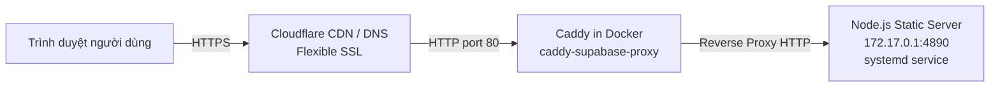

# Hướng dẫn Deploy & Vận hành: day.samnguyenphoto.com

Tài liệu triển khai và vận hành hệ thống Bảng đen & Studio giảng dạy cho domain `day.samnguyenphoto.com`.

---

## 1. Kiến trúc hệ thống



- **Cloudflare**: Xử lý chứng chỉ SSL/TLS phía ngoài (Flexible mode), forward request dạng HTTP về IP VPS.
- **Caddy (Docker)**: Chạy trong container `caddy-supabase-proxy`, lắng nghe port 80 trên host, định tuyến và reverse proxy sang backend gateway `172.17.0.1:4890`.
- **Node.js Static Server**: Chạy qua systemd unit `sam-teaching-visual-day.service`, phục vụ file tĩnh từ `/srv/day.samnguyenphoto.com/dist` bằng lệnh `/usr/bin/node scripts/serve.mjs --dist`.

---

## 2. Định tuyến (Routes)

| Đường dẫn (URL) | Đích phục vụ | Mô tả |
|---|---|---|
| `https://day.samnguyenphoto.com/` | `/board.html` | Màn hình Bảng đen toàn khung tối giản (viết/vẽ trực tiếp) |
| `https://day.samnguyenphoto.com/bang-den` | `/board.html` | Đường dẫn tường minh đến màn hình Bảng đen |
| `https://day.samnguyenphoto.com/studio` | `/index.html` | Studio giảng dạy đầy đủ tính năng |

---

## 3. Cách Deploy

Chạy script deploy tự động (hỗ trợ WSL và Git Bash trên Windows):

```bash
bash deploy/day.samnguyenphoto.com/deploy.sh
```

Hoặc nếu muốn chỉ định alias SSH khác (mặc định là `infiniti-vps`):

```bash
REMOTE=vps bash deploy/day.samnguyenphoto.com/deploy.sh
```

Quy trình tự động gồm 9 bước:
1. Chạy `npm run build` tại máy local để xuất bản thư mục `dist/`.
2. Đóng gói `dist/` và `scripts/serve.mjs` bằng `tar` và chuyển lên `/srv/day.samnguyenphoto.com/`.
3. Cài đặt và kích hoạt systemd unit `sam-teaching-visual-day.service`.
4. Smoke nội bộ port 4890 trên VPS (kiểm tra `http://127.0.0.1:4890/board.html`).
5. Cài đặt file Caddy cấu hình vào `/root/caddy/conf.d/`, sao lưu `Caddyfile.app` và thêm dòng `import`.
6. Kiểm tra cấu hình Caddy bằng `caddy validate` (tự động rollback nếu sai cú pháp).
7. Khởi động lại container `caddy-supabase-proxy`.
8. Smoke nội bộ qua Caddy port 80 với Host header `day.samnguyenphoto.com` (kiểm tra `/`, `/bang-den`, `/studio`).
9. Smoke ngoài internet qua Cloudflare HTTPS.

---

## 4. Giám sát & Xem Log

- **Log tiến trình Node.js (systemd journal)**:
  ```bash
  ssh infiniti-vps "journalctl -u sam-teaching-visual-day -n 50 --no-pager"
  ```
- **Log file stdout/stderr của Node.js**:
  ```bash
  ssh infiniti-vps "tail -n 50 /var/log/sam-teaching-visual-day.log"
  ```
- **Log truy cập Caddy**:
  ```bash
  ssh infiniti-vps "tail -n 50 /var/log/caddy/day.samnguyenphoto.com-access.log"
  ```

---

## 5. Quy trình Rollback

Nếu cần gỡ bỏ hoặc hoàn tác domain `day.samnguyenphoto.com`:

1. Dừng và vô hiệu hóa service Node.js:
   ```bash
   ssh infiniti-vps "systemctl stop sam-teaching-visual-day && systemctl disable sam-teaching-visual-day"
   ```
2. Khôi phục file cấu hình Caddy từ bản sao lưu gần nhất (hoặc xóa dòng `import /etc/caddy/conf.d/day.samnguyenphoto.com.caddy` trong `/root/caddy/Caddyfile.app`):
   ```bash
   ssh infiniti-vps "cp /root/caddy/Caddyfile.app.bak_day_<timestamp> /root/caddy/Caddyfile.app"
   ```
3. Khởi động lại Caddy container:
   ```bash
   ssh infiniti-vps "docker restart caddy-supabase-proxy"
   ```

---

## 6. Bảng xử lý 3 lỗi thường gặp

| Hiện tượng | Nguyên nhân gốc | Cách khắc phục |
|---|---|---|
| **308 Redirect Loop** | 1. Cấu hình Caddy thiếu tiền tố `http://` làm Caddy tự bật auto-HTTPS port 443 (xung đột với Cloudflare Flexible).<br/>2. Chưa import file `.caddy` vào `Caddyfile.app`.<br/>3. Chưa khởi động lại container Caddy (chỉ `reload` không xóa trạng thái auto_https đã cache). | 1. Đảm bảo khối Caddy bắt đầu bằng `http://day.samnguyenphoto.com { ... }`.<br/>2. Kiểm tra dòng `import /etc/caddy/conf.d/day.samnguyenphoto.com.caddy` trong `/root/caddy/Caddyfile.app`.<br/>3. Chạy `docker restart caddy-supabase-proxy`. |
| **502 Bad Gateway** | Service Node.js tĩnh trên VPS chưa chạy hoặc bị crash (port 4890 không phản hồi). | 1. Kiểm tra trạng thái: `systemctl status sam-teaching-visual-day`.<br/>2. Xem log lỗi: `journalctl -u sam-teaching-visual-day -n 40 --no-pager` hoặc `/var/log/sam-teaching-visual-day.log`.<br/>3. Kiểm tra file `/srv/day.samnguyenphoto.com/scripts/serve.mjs` có tồn tại và đúng quyền thực thi hay không. |
| **404 Not Found (Asset / File)** | 1. Chưa chạy `npm run build` trước khi đẩy lên VPS.<br/>2. File asset mới (ví dụ `.css`, `.mjs`) chưa được thêm vào mảng `entries` trong `scripts/build.mjs` nên không được copy vào `dist/`. | 1. Chạy `npm run build` trên máy local.<br/>2. Kiểm tra `scripts/build.mjs`, đảm bảo các file tĩnh cần thiết đã có trong mảng `entries`.<br/>3. Kiểm tra thư mục `/srv/day.samnguyenphoto.com/dist` trên VPS. |
